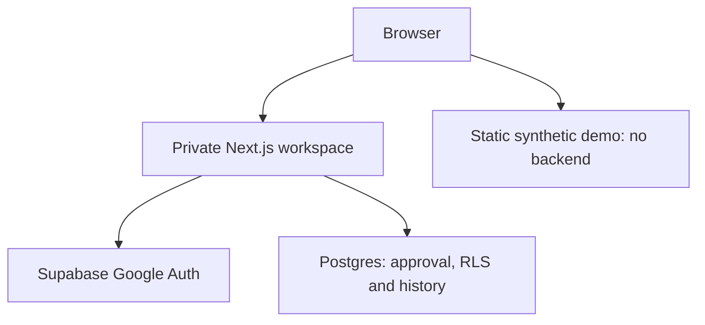

# Architecture

Blueprint Recruiting separates persistent people from seasonal recruiting decisions, and keeps approval and history enforcement in the database as well as the UI. The existing Next.js App Router, Supabase Postgres/Auth and Vercel deployment are retained. Dependency versions are pinned; no new package is needed for Phase 7.

## Runtime boundaries

The private workspace verifies `getUser()` server-side on guarded requests, then reads the current leadership profile. Cookies and user-editable metadata never establish approval. New Auth accounts get inactive profiles; administrators approve individuals in Supabase. The request proxy and guarded Server Components/Actions fail closed on identity, approval or configuration failure. RPCs/private helpers independently check current approval.

The synthetic demo compiles from a fixed, deliberately fictional module into `public/demo/`, which is also independently hostable. It imports no Auth/database client, accesses no private environment variables and has no write endpoint. Its public static route is not a private workspace authentication mode.

## Data model

| Relation | Responsibility | Retention / access |
| --- | --- | --- |
| public.profiles | Individual leadership identity, display name and approval | Own full profile only; no client approval writes |
| public.seasons | Unique year, current flag, active/closed status, trusted closure metadata | Approved leadership reads; narrowly guarded start/close transitions; no client direct writes/deletes |
| public.prospects | Shared name/contact/location/team/physical facts | Current values shared across all years; no client deletion |
| public.candidacies | Unique person × season; stage, priority, owner, actions/date, three projections, outcome and version | Approved leaders edit active seasons only; history cannot move or be deleted |
| public.evaluations | Unique candidacy × evaluator; six nullable 1–5 attributes and protected author/name/version/times | Approved leaders read before own submission; only author edits in active seasons; former/historical rows retained |
| public.prospect_activity | Immutable real field-change events, trusted actor snapshot and season/shared-facts context | Approved leadership reads; only private triggers write |
| private.prospect_import_rows | Source row × batch × season receipt, person reference and input fingerprint | RLS with default denial and no ordinary client grants; guarded importer only; no fact payload |

All six public tables have RLS and explicit minimum grants. Foreign keys restrict history deletion. Lookup indexes cover normalized names, seasonal membership, owners, follow-ups, timelines, evaluators and import references. Informational unused-index notices on a small database do not justify dropping retention/lookup indexes.

Facts are not historical snapshots. A later edit to a person's contact details appears when viewing older seasons; historical workflow/evaluations/outcomes remain distinct. Stage describes recruiting progress and outcome records a seasonal result. Unknown outcomes stay unset, and projections are qualitative text rather than roster-composition modeling.

## Reads and writes

Server Components read guarded records. Dashboard and evaluation-summary security-invoker RPCs use caller RLS and bounded pagination with exact totals: ten queue rows, 25 comparison rows. Dashboard reads share one database snapshot; dates compare against UTC today, including today in upcoming. Recent activity includes the selected season plus shared-fact edits for that season's people. Evaluation averages independently exclude N/A for each attribute and include all submitted rows, not just a comparison page.

Server Actions whitelist business fields, recheck relationships/status and compare protected row versions. Updates use a version predicate; database guards increment versions only on real changes. Workflow and outcome forms share a candidacy version, while evaluations have individual author-row versions. A stale form must reload rather than overwrite newer changes.

Private AFTER triggers append trusted author/time/old/new activity in the same transaction as a mutation. No-op updates do not create events. Clients cannot forge author snapshots, edit timestamps, write timeline entries or reconstruct earlier interactions. Logging begins at the actual migration/import time.

Ownership requires an active leadership profile for new assignment. Existing revoked owners/evaluators and their stored authorship remain visible to approved leadership. Full profile emails are not exposed through the minimal ownership directory.

## Seasonal transitions

Start/close public RPCs are invoker wrappers around private guarded helpers. These helpers lock the active caller profile and serialize season management. Starting a later year creates an empty active current season and does not implicitly close another year. Closing validates the exact year, locks the season for update, stamps the trusted caller ID/name and time, and removes its current flag.

Candidacy and evaluation write guards hold a SHARE lock on the same active-season row. Closure waits for those transactions; subsequent seasonal writes reject the closed status. No rows or missing outcomes are rewritten on closure. Repeated closure preserves its original stamp. The app has no reopen action; infrastructure administrators retain their normal privileged powers. Legacy closed seasons have no fabricated closure date/author.

Adding to a later year reuses the person and inserts only a unique new membership. Seasonal workflow, projections, outcomes and evaluations are not copied. Without a current season, default selection prefers the latest remaining active year, then the latest historical year; explicit historical URLs remain valid.

## Private import

The Python script uses the standard library to validate a private CSV, map known facts, enforce a default ten-row batch and optionally generate owner-readable private SQL. It has no networking or credentials and does not log source values. Generated payloads stay outside Git or under ignored `data/private/`.

`import_prospects` is a public invoker wrapper. Its private privileged helper has an empty search path, checks/locks current approval and active-season status, validates field names/types/ranges, serializes imports and records private receipts. Privileged access is restricted to this defined operation; it is not a generic RLS bypass or arbitrary update API. New records use the existing creation/logging functions. Explicit existing-person references require matching normalized names and do not overwrite shared facts.

The batch's people, candidacies, activity and receipts commit atomically. Unchanged source IDs/input fingerprints are skipped; changed previously imported input requires review. Duplicate names require an explicit existing-person reference instead of automatic identity matching. Receipt fingerprints detect changes and do not serve as credentials. A closed season cannot receive imports, even repeated ones.

## Verification and deployment

Unit checks, private-import Python tests, typecheck and production builds run in GitHub Actions. Runtime tests run the built Next.js app against an isolated synthetic HTTP provider without changing production authorization. Hosted browser stories verify interactive workflow, dashboard, evaluations, continuity and the anonymous static demo. Hosted SQL permission scripts separately exercise real Postgres RLS/grants/triggers/transactions and roll back all fixtures.

The existing Vercel GitHub integration builds branches/previews and deploys merged main. Supabase migrations are applied to the existing project and their filenames match its migration ledger. Migration application and source deployment are separate operations; merging source must not rerun already-applied DDL. Preview build success is not proof of an approved authenticated production session.

See [verification](VERIFICATION.md), [private import](IMPORT.md), [demo](DEMO.md) and [scope](SCOPE.md). Notes/manual interactions, notifications, AI and tryout/roster management are excluded from Phase 7.
