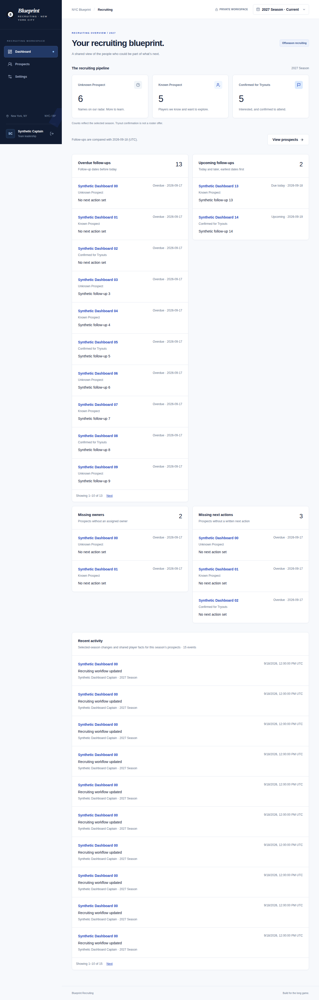
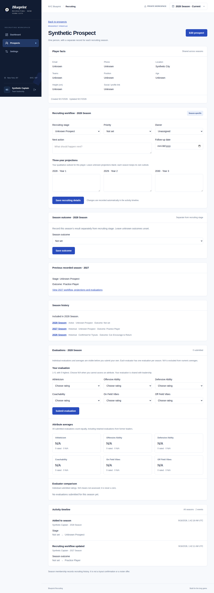

# Blueprint Recruiting: building shared recruiting memory

**Product owner:** Sam Alston, NYC Blueprint captain. **Implementation assistance:** Codex. **Users:** approved team captains and coaches. **Stack:** Next.js, Supabase Auth/Postgres and Vercel. This case study uses entirely synthetic screenshots and examples; real player information stays private.

## The problem

Recruiting continues across offseasons, while leadership must decide who to contact, who owns the relationship, what happens next and what the team learned about a player last year. A simple name list does not capture those decisions. Recreating a player each season loses continuity; carrying everything forward obscures which observations belong to which year.

The product brief therefore focused on shared recruiting memory and clear ownership during outreach. Everyone ultimately tries out: confirming attendance is not a roster offer. The objective was a usable leadership workflow, with an explicit boundary around tryout-event management and roster composition planning.

## Product ownership and scope

Sam set the phased requirements and recruiting vocabulary, and confirmed the deployed Google sign-in, manual approval and prospect screens. The implementation followed seven bounded phases: access, prospect records, recruiting workflow, dashboard, evaluations, historical continuity, and data/portfolio preparation. Each phase produced a reviewable PR and verification evidence. Coding and checks were assisted by Codex; this is not a claim that every line was authored manually.

The core decisions were to use individual approved accounts, distinguish persistent facts from seasonal decisions, keep progress stages separate from final outcomes, and avoid inventing unknown information. Notes, automated reminders, AI summaries and broader sports-management features remained outside the initial scope.

## From requirements to behavior

| Decision | Resulting behavior | Why it matters |
| --- | --- | --- |
| One person, multiple seasonal candidacies | Existing people can be added to a later year without duplication | Relationship memory persists while each year's recruiting context stays distinct |
| Stage and outcome are separate | Confirmed for Tryouts remains a stage; Rostered or Cut–Encourage to Return is a seasonal result | Interest/attendance does not imply a roster decision |
| Unknown is explicit | Missing facts/projections/outcomes remain unset; every evaluation attribute chooses 1–5 or N/A | The interface avoids false precision and invented scouting information |
| Independent attribute denominators | N/A is excluded from each average; no numeric scores yields N/A rather than zero | Evaluators can compare observations without treating missing knowledge as poor performance |
| Named ownership and next steps | Dashboard identifies overdue dates, unassigned owners and missing actions | Leadership can see which relationships need attention |
| Database approval and version checks | Revoked users lose access; stale forms cannot overwrite newer changes | Multiple leaders can work with clear access and editing boundaries |
| Immutable automatic activity | Actual important edits record trusted author/time and before/after values | Recruiting memory remains attributable without relying on manual audit entry |
| Close a season without clearing it | Historical workflow, results and ratings stay read-only; new memberships start fresh | Historical knowledge informs the next year without silently becoming a current assessment |

## Example journey

A fictional prospect is added with only a name and known shared facts. A leader assigns an approved owner, records outreach and chooses a follow-up date. The dashboard places the prospect in the selected year's appropriate queue. Evaluators independently submit numeric ratings or N/A; everyone in approved leadership can see the individual entries and attribute means before submitting their own.

At season end, leadership explicitly records a result and types the year to close that season. Next year, the same person gets a fresh seasonal membership. Their prior outcome, projections and evaluations remain available through previous-season context and historical links; current workflow and ratings are not copied.

## Engineering choices and tradeoffs

The application preserves the existing Next.js/Supabase/Vercel stack. Server-side identity verification, current profile approval, table RLS and minimal column grants protect private records. Important changes and their activity share a database transaction. Season closure locks the same rows used by seasonal writes; row versions protect concurrent leadership edits.

Shared person facts deliberately represent the latest information, including on historical pages. This avoids duplicate contact records but does not reconstruct past phone numbers or physical attributes. Historical scouting decisions remain separate seasonal data. Duplicate-name detection is a warning rather than a universal uniqueness rule because different people can share names; imports require an explicit existing-person reference to resolve a match.

Qualitative three-year projections describe a player outlook, without promising a quantitative roster forecast. Follow-up dates organize work but do not send notifications. Former owners/evaluators remain in history instead of being silently removed when access is revoked.

For portfolio sharing, a separate static runtime uses ten invented people and illustrative activity. It has no backend or write endpoint and can run without the private app's credentials. This makes the product understandable without exposing private recruiting records or weakening production access.

## Delivery evidence and current limits

Phase 1 Google sign-in, manual approval and dashboard access were user-confirmed; the Phase 2 deployed prospect screens were also confirmed. Later capabilities are supported by unit/type/build checks, built-app runtime/browser stories and separate hosted Postgres permission tests with rolled-back synthetic fixtures. The linked [verification record](VERIFICATION.md) and PRs distinguish automated checks from actual production-user confirmation.

Phase 7's private import tooling is implemented and tested against ten synthetic rows, including atomic rollback, retry safety and duplicate resolution. **The ten-real-prospect import remains pending because no designated source file or target season was provided.** A test fixture is not counted as a production import.

No measured reduction in recruiting time, adoption increase or improved roster outcome is claimed. The initial implementation establishes the workflow and safety properties; impact needs observation over a recruiting cycle. Useful future measures are the share of prospects with an owner/next action, overdue-follow-up completion, leadership usage and successful reuse of prior-season profiles. Collect them privately before making outcome claims.

## What this demonstrates

The project connects a captain's operational problem to a bounded product workflow, a data model that preserves context, and reviewable delivery evidence. The difficult choices were less about adding screens than about defining what belongs to a person versus a season, what missing ratings mean, how leaders can safely collaborate, and how to show the product publicly without exposing its users.

[Architecture](ARCHITECTURE.md) · [Screenshot gallery](SCREENSHOTS.md) · [Synthetic demo](DEMO.md) · [Import guide](IMPORT.md)
