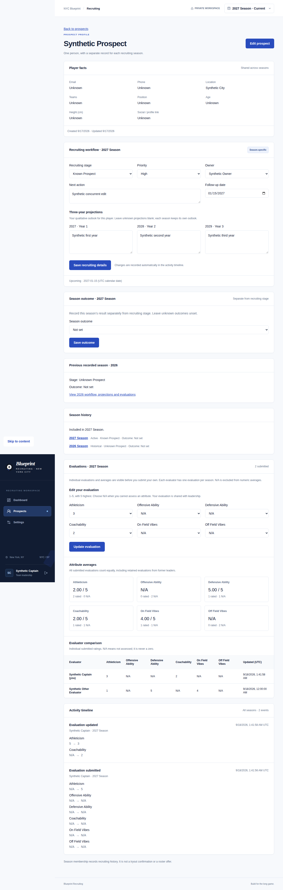
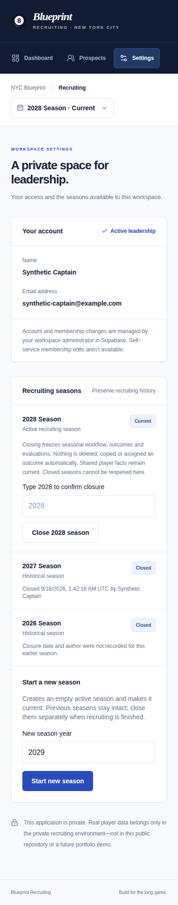

# Product screenshots

Every screenshot below comes from hosted interactive browser tests using an isolated synthetic provider and unchanged application authorization. All names, contacts and ratings shown are fictional; no production workspace was captured. Source run: [Phase 6 verification 35296252994](https://github.com/samhillalston-sha/Blueprint-Recruitment/actions/runs/35296252994), application commit `4eb339d5e12e2b37b6f67515438d8f31ed5db130`. The Phase 7 PR retains additional standalone-demo desktop/mobile captures.

## Recruiting dashboard

Selected-season counts, follow-up queues, missing owners/actions and scoped recent activity. These are synthetic test scenarios, not production recruiting totals.

## Evaluator comparison

Individual fictional ratings and per-attribute means demonstrate N/A exclusion and an editable own evaluation. The comparison scrolls within its container on mobile.

## Seasonal continuity

A fresh 2028 membership preserves the same person's 2027 result and 2026 historical record. Current seasonal fields and evaluations begin empty.

## Season controls on mobile

The active season has exact-year closure confirmation. A newly closed season records its author/time; the earlier closed season retains unknown closure metadata. Starting a new season is explicit.

