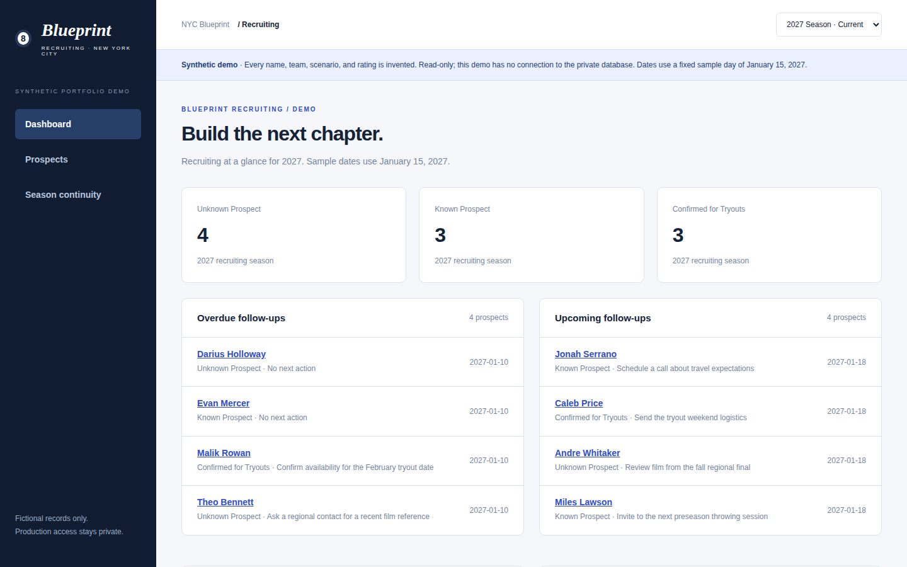
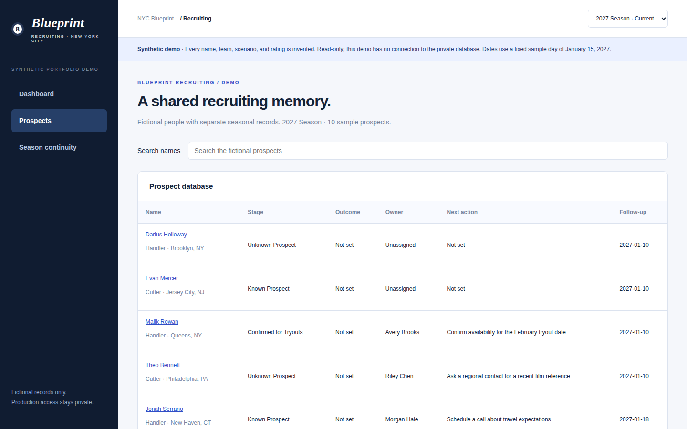
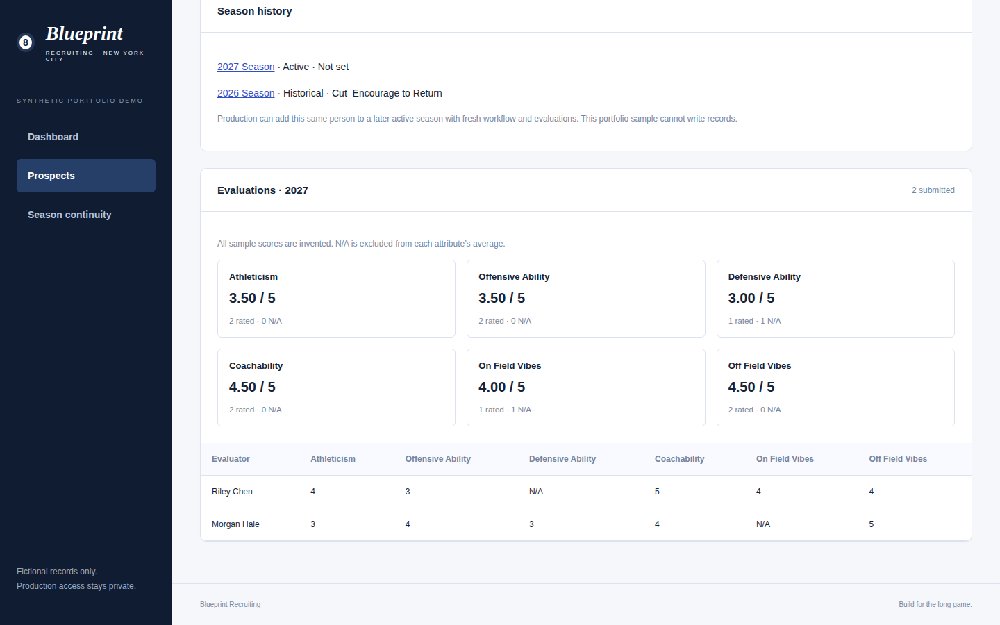
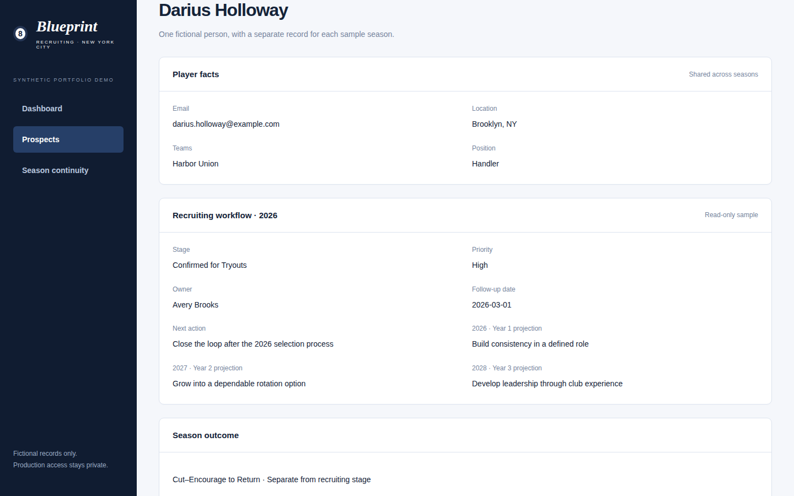
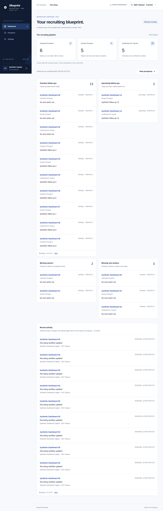
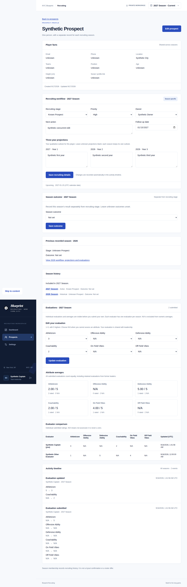
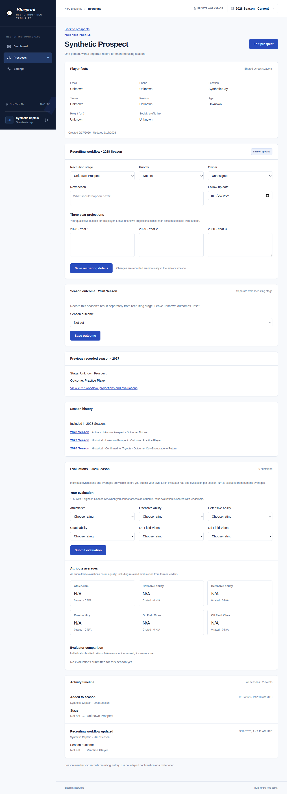
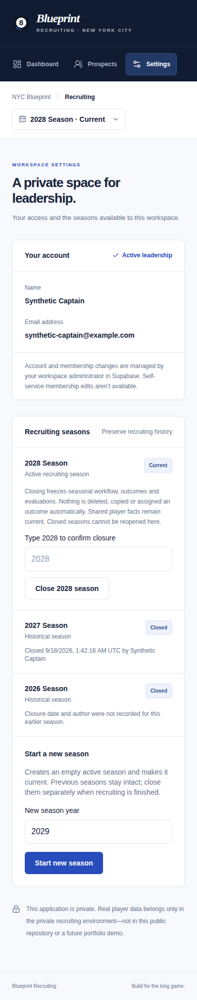

# Product screenshots

The case-study images are framed 1440×900 browser captures of the public, read-only synthetic demo. All names, teams, contacts, scenarios and ratings are invented; no production workspace was captured. They were generated by [hosted browser verification run 36509684361](https://github.com/samhillalston-sha/Blueprint-Recruitment/actions/runs/36509684361) from commit `2380ee2fc32a631d1405cc388275cec7ee227e33`. The static demo has no private backend or write endpoint.

## Case-study views

### Recruiting dashboard

Selected-season stage counts and overdue/upcoming follow-up queues. These are fictional sample totals, not production recruiting counts.

### Prospect database

Fictional names, locations, stages, owners, next actions and follow-up dates at a glance.

### Evaluation comparison

Individual invented ratings and per-attribute means show how N/A values are excluded from their own attribute's denominator.

### Historical season

One fictional person's 2026 recruiting workflow and separate outcome, shown after switching away from the active 2027 season.

## Full-page private-app test captures

The older images below come from hosted interactive browser tests using an isolated synthetic provider and unchanged application authorization. They show additional private-app forms and controls, but their full-page length makes them less suitable for a case study. Source: [Phase 6 verification 35296252994](https://github.com/samhillalston-sha/Blueprint-Recruitment/actions/runs/35296252994), application commit `4eb339d5e12e2b37b6f67515438d8f31ed5db130`.

### Recruiting dashboard

Selected-season counts, follow-up queues, missing owners/actions and scoped recent activity. These are synthetic test scenarios, not production recruiting totals.

### Evaluator comparison

Individual fictional ratings and per-attribute means demonstrate N/A exclusion and an editable own evaluation. The comparison scrolls within its container on mobile.

### Seasonal continuity

A fresh 2028 membership preserves the same person's 2027 result and 2026 historical record. Current seasonal fields and evaluations begin empty.

### Season controls on mobile

The active season has exact-year closure confirmation. A newly closed season records its author/time; the earlier closed season retains unknown closure metadata. Starting a new season is explicit.

